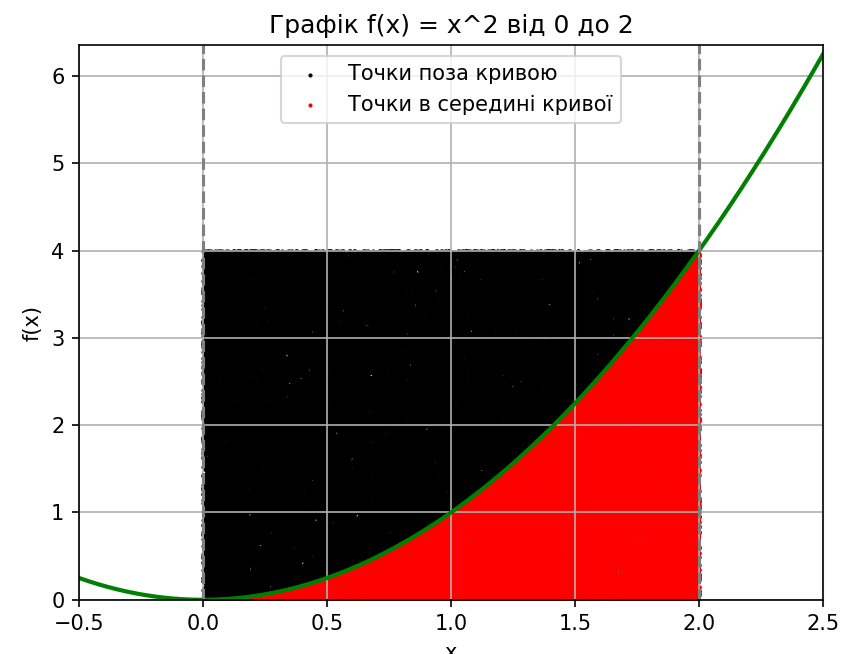

# Обчислення визначеного інтеграла методом Монте-Карло

## Результати
Аналітичний розв'язок дає результат 2.666667

Метод монтекарло при різній кількості точок та похибка від аналітичного:
Кількість точон 1000
Монте-Карло: 2.784000, похибка: 0.117333
Кількість точон 10000
Монте-Карло: 2.691200, похибка: 0.024533
Кількість точон 100000
Монте-Карло: 2.667440, похибка: 0.000773

Після повторного прогону маємо трохи інші результати:
Кількість точон 1000
Монте-Карло: 2.680000, похибка: 0.013333
Кількість точон 10000
Монте-Карло: 2.652000, похибка: 0.014667
Кількість точон 100000
Монте-Карло: 2.652960, похибка: 0.013707

### Графік функції з точками

## Висновки

Як бачимо, метод Монте-Карло досить точно знаходить шукану площу і його можна використовувати для такого розу підрахунків, де з розрахунком напряму є складнощі.
Також бачимо, що із збільшенням кількості точок, точніть зростає. Але також можливі ситуації, коли точніть не буде змінюватись із збільшенням кількості точок. Це обумовлено тим, що ми використовуємо рандомні значення, хоча і з більш рівномірним розподілом. Тому кількість точок треба вибирати під конкретну задачу, здебільшого достатньо буде середньої кількості, щоб отримати результат, що буде задовольняти.
